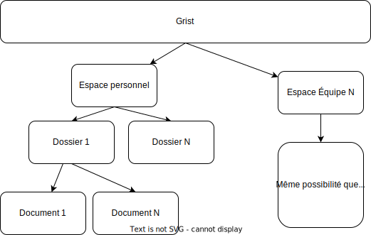

## Documentation Grist

Cette documentation décrit le processus d'un projet Grist, de la phase de cadrage du projet à l'exploitation des données avec ChartsGouv

## Table des matières
- [Documentation Grist](#documentation-grist)
  - [Table des matières](#table-des-matières)
  - [Prendre en main Grist](#prendre-en-main-grist)
    - [Glossaire et ressources](#glossaire-et-ressources)
    - [Convention de nommage](#convention-de-nommage)
    - [Widget custom](#widget-custom)
  - [Accompagner un projet Grist](#accompagner-un-projet-grist)
    - [Cadrer le besoin métier](#cadrer-le-besoin-métier)
    - [Lister et structurer les données](#lister-et-structurer-les-données)
    - [Création du document Grist](#création-du-document-grist)
    - [Estimer le coût évité](#estimer-le-coût-évité)
  - [Tableau de bord](#tableau-de-bord)
  - [Créer automatiquement un document Grist](#créer-automatiquement-un-document-grist)

## Prendre en main Grist
### Glossaire et ressources

Le glossaire suivant permet de faire le lien entre le vocabulaire Grist et le vocabulaire des tableurs plus classiques type Excel.

| Intitulé Grist | Équivalent Excel | Description |
| :--------------- |:---------------|:---------------|
| Document  | "Fichier Excel" | Regroupe l'ensemble des pages et de tables|
| Page  | Onglet | Permet de visualiser une ou plusieurs tables/vues |
| Table  | Onglet dédié à une seule source de données | Élément élémentaire de Grist. Contient la structure des données |
| Vue/widget  | TCD, graphiques, ... | Permet de représenter les tables sous d'autres formats (graphiques, cartes, ...) |

Pour consulter le glossaire complet, voir la documentation officielle [https://support.getgrist.com/fr/glossary/](https://support.getgrist.com/fr/glossary/)

Pour démarrer avec Grist, un certains nombre de ressources sont disponbles.  
Pour une première prise en main, le lien suivant fournit une très bonne base des principaux éléments qui composent Grist avec des exemples illustrés : [https://docs.numerique.gouv.fr/docs/ad3eb0ac-575c-44b0-88ff-fe05473057c6/](https://docs.numerique.gouv.fr/docs/ad3eb0ac-575c-44b0-88ff-fe05473057c6/).

Conceptuellement, Grist s'organise de la manière suivante  


Ce fonctionnement est similaire à une organisation d'un réseau partagé par exemple.

### Convention de nommage

La convention de nommage vise à:
- Harmoniser et faciliter la compréhension des différents documents Grist
- Automatiser certaines tâches grâce à des préfixes/suffixes spécifiques (ex: préfixe "ref_" pour les tables de référentiels)

Voir la section Grist de la documentation [convention.md#grist](./convention.md#grist).  


### Widget custom

Un widget custom permet de représenter des données dans un format sur-mesure.  
Avant de se lancer dans la création d'un widget custom, il est important de regarder si quelqu'un ne l'a pas déjà créé !  
Ce lien permet de consulter les widgets custom déjà créés: [https://forum.grist.libre.sh/t/gristup-un-catalogue-communautaire-de-widgets-pour-grist/2949](https://forum.grist.libre.sh/t/gristup-un-catalogue-communautaire-de-widgets-pour-grist/2949)

Avant d'utiliser des widgets custom, il est bon de rappeler que:  
⚠️Attention, les custom widgets peuvent contenir du code malveillant ou des failles de sécurité.  
⚠️**Ne donnez jamais votre clé API ou l’accès complet à votre document** si vous n’êtes pas certain de faire confiance au code et au développeur / si vous n’avez pas audité le code.

Si vous souhaitez mettre des widgets custom à disposition de vos utilisateurs, le plus simple est de créer un repo github et définir une méthode pour que les utilisateurs puissent facilement proposer des nouveaux widgets.  

A date, les repo github sûrs sont les suivants:
- DINUM => [https://github.com/betagouv/grist-custom-widgets-fr-admin](https://github.com/betagouv/grist-custom-widgets-fr-admin) (déjà intégré dans l'instance DINUM)
- GristLabs => [https://github.com/gristlabs/grist-widget](https://github.com/gristlabs/grist-widget)

Recommandation: réaliser un fork du github de la DINUM et y ajouter vos propres widgets custom.

## Accompagner un projet Grist

Les projets Grist peuvent être catégorisés en 2 grandes familles:
- Les projets **autonomes**

Les agents métiers s'emparent de l'outil et créént leur document Grist. L'enjeu pour les projets de ce type est de s'assurer de fournir les bonnes ressources pour que l'agent puisse se former sur son outil.  
Il est également nécessaire de définir une méthodologie pour que le service numérique puisse être sollicité en cas de besoin (ex: difficulté à structurer les données, besoin d'un widget custom, ...)

- Les projets **accompagnés**

Le service numérique est sollicité pour accompagner accompagner les agents métiers dans la construction du document Grist.  
La section ci-dessous décrit la méthodologie d'accompagnement pour ce type de projet.

### Cadrer le besoin métier

Une première réunion de cadrage doit permettre de définir à minima:
- Les objectifs que le document Grist doit couvrir
- Les fonctionnalités attendues et le processus dans lequel le document Grist s'intègre.
- Définir si certaines données proviennent de SI

Ce premier échange doit aussi permettre de savoir d'où proviennent les données dans le processus actuel et qui sont les acteurs impliqués.

>**📣A noter📣**  
Il est important d'avoir une vue d'ensemble sur la totalité du processus métier dans lequel le document Grist va s'intégrer. Cela permettra de construire un document Grist le plus modulaire possible et faciliter l'intégration de nouvelles fonctionnalités.

### Lister et structurer les données

A partir du cadrage du besoin métier, il est nécessaire de faire une liste la plus exhaustive possible des données qui seront utilisées dans le document Grist. Des ajouts/modifications/retraits pourront toujours être possible pendant la phase d'itérations sur le document Grist.

A partir de la liste des données, celles-ci doivent être regroupées par entité logique/métier. Il faut respecter au mieux la 3ème normalisation des données.
Cette étape est la plus importante et nécessite d'être itérée avec l'agent métier.

Ci-dessous un exemple pour illustrer cette étape.  

**Objectif**: Faciliter le suivi des projets d'un service  
**Acteurs concernés**: Tous les bureaux du service (certains utilisateurs seront des lecteurs et d'autres des éditeurs)

Quelques exemples non-exhaustifs de questions à se poser pour aider à la structuration des données:  
Q: Qu'est ce qui définit un projet ?  
R: Un projet est défini par un nom, une description, une date de début, une date de fin, un bureau associé, un état d'avancement, ...

Q: Qu'est ce qui définit un bureau ?  
R: Un bureau est défini par un nom, un sigle, des poles, ...

Q: Les bureaux saisent-ils des données qui leurs sont propres ?  
R: Oui, le bureau X saisit le montant du projet et qui est le porteur

A partir de ces premiers éléments de réponses, nous pouvons déjà faire une première ébauche de la structuration des données et l'implémenter dans Grist.

| Nom de la table | Nom de la colonne | Type de la colonne |
| :--------------- |:---------------|:---------------|
| projet  | nom | Texte |
|   | description | Texte |
|   | date de début | Date |
|   | date de fin | Date |
|   | bureau associé | Référence |
|   | état d'avancement | Référence |
| projet_complement_bureau_X  | nom du projet | Référence |
|   | montant | Numérique |
|   | porteur | Référence |
| bureau  | nom | Texte |
|   | sigle | Texte |
|   | poles | Texte |
| agents  | mail | Texte |
|   | bureau | Référence |
|   | poles | Référence |

> Il est important de questionner le lien entre les différentes entités pour privilégier des données en type "référence" plutôt que de laisser l'utilisateur re-saisir des données à chaque fois. Le type "référence" permet d'obtenir une liste déroulante lors de la saisie de l'information.

### Création du document Grist

Pour conserver une structure similaire à l'ensemble des projets, l'organisation suivante est proposée
```
.
├── Intitulé du document Grist
│   ├── Accueil
│   ├── 📊Reporting
│   │   ├── vue_1
│   │   ├── ...
│   │   └── vue_n
│   ├── 🖋️Saisie
│   │   ├── saisie_1
│   │   ├── ...
│   │   └── saisie_n
│   ├── ⚙️Référentiels
│   │   ├── ref_1
│   │   ├── ...
│   │   └── ref_n
│   ├── 📚Documentation
│   ├── 🚧Zone administrateurs
│   │   └── habilitations
│   ├── ⛔Structure des données
│   │   ├── table_1
│   │   ├── ...
│   │   └── table_n
```

Cette structuration est une base à adapter selon la complexité des cas d'usages.

**Accueil**  

Cette page contient une documentation qui décrit la finalité du document et permet de guider l'utilisateur à travers les différents onglets.

**Reporting**  

Cet onglet contient la/les page(s) à partir desquels l'utilisateur pourra visualiser un certains nombre d'indicateurs sur ses données.  
Pour du reporting plus poussés, on utilisera plutôt l'outil de datavisualisation dédié (voir la section <[Tableau de bord](#tableau-de-bord)>)

**Saisie**  

Cet onglet contient la/les page(s) à partir desquels l'utilisateur pourra saisir des données.

**Référentiels**  
Les tables de référentiels doivent être regroupées dans un onglet `onglet_referentiel`.  
Ci-dessous un exemple  
  

| Label | Nom technique |
| :--------------- |:---------------|
| Référentiel  | onglet_referentiel |
| Direction  | ref_direction |
| Service  | ref_service |

**Documentation (Optionnel)**  

Documentation complémentaire. Elle peut servir de glossaire, préciser des modalités pour compléter le document ou décrire les règles de gestions qui sont appliquées.

**Zone administrateurs**  

Cet onglet contient exclusivement la table pour gérer les utilisateurs qui ont accès au document Grist et leurs profils.

**Structure des données**  

Toutes les tables métiers doivent être dans un format table par défaut dans l'onglet `onglet_structure`.  
L'objectif est de pouvoir travailler et modifier facilement les tables sans avoir à travailler depuis des widgets/pages spécifiques.  
Ci-dessous un exemple  

  

| Label | Nom technique |
| :--------------- |:---------------|
| ⛔ Structure des données  | onglet_structure |
| projet  | projet |
| selecteur  | selecteur |


>**📣A noter📣**  
> Les onglets **Reporting & Saisie** peuvent être rassemblés dans une même et unique page "hybride" si le cas d'usage et l'ergonomie le permet.

### Estimer le coût évité

**Méthodologie à définir**

## Tableau de bord

Grist est un très bon outil pour récupérer et structurer de la donnée. Il possède également des fonctionnalités de datavisualisation mais elles sont limitées (sauf à faire du sur-mesure avec des widgets custom).  
Pour des besoins de datavisualisation plus poussés, il est préférable d'utiliser un outil de datavisualisation dédié (ex: ChartsGouv - Apache Superset).

La suite de cette section est pour un public plus technique.

### Connecter le document Grist à l'outil de datavisualisation

Une fois le document créé dans Grist, il peut être connecté à l'outil de datavisualisation.

### Générer les tables au format dbml

Depuis Grist, exporter la structure des données (sans les données).  
  

Convertir le document Grist en fichier dbml. L'outil suivant permet de faire cette conversion: [https://github.com/ytihianine/grist-doc-to-db-parser](https://github.com/ytihianine/grist-doc-to-db-parser)

### Générer les ERD associés au document

Importer le fichier dbml dans [https://dbdiagram.io](https://dbdiagram.io).  
L'ensemble des tables seront présentées sous forme de diagramme.

### Générer le script SQL

Depuis [https://dbdiagram.io](https://dbdiagram.io), exporter le résultat au bon format pour PostgreSQL.

### Créer le dag associé

La dernière étape est de créer le dag qui ira récupérer les données depuis Grist. Voir la documentation [dags.md](./dags.md) pour le créer.

## Créer automatiquement un document Grist

_réflexion en cours_

objectif: convertir automatiquement la structure des données définies avec les métiers en document Grist
