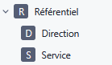
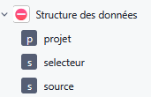
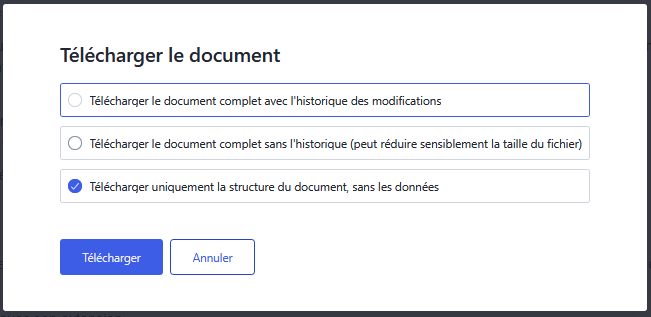

## Documentation Grist

Cette documentation décrit le processus d'un projet Grist, de la phase de cadrage du projet à l'exploitation des données avec ChartsGouv

## Table des matières
- [Réaliser un projet avec Grist](#realiser-un-projet-avec-grist)
  - [Table des matières](#table-des-matières)
  - [Glossaire](#glossaire)
  - [Convention de nommage](#convention-de-nommage)
  - [Réaliser un projet Grist](#réaliser-un-projet-grist)
  - [Créer automatiquement un document Grist](#créer-automatiquement-un-document-grist)

## Glossaire

Le glossaire suivant permet de faire le lien entre le vocabulaire Grist et les tableurs classiques type Excel

| Intitulé Grist | Équivalent Excel | Description |
| :--------------- |:---------------|:---------------|
| Document  | "Fichier Excel" | Regroupe l'ensemble des pages et de tables|
| Page  | Onglet | Permet de visualiser une ou plusieurs tables/vues |
| Table  | Onglet dédié à une seule source de données | Élément élémentaire de Grist. Contient la structure des données |
| Vue/widget  | TCD, graphiques, ... | Permet de représenter les tables sous d'autres formats (graphiques, cartes, ...) |

Pour consulter le glossaire complet, voir la documentation officielle [https://support.getgrist.com/fr/glossary/](https://support.getgrist.com/fr/glossary/)

## Convention de nommage

Voir la section Grist de la documentation [convention.md](./convention.md#grist)

## Réaliser un projet Grist

### Cadrer le besoin métier

Comme tout projet informatique, une première réunion de cadrage est nécessaire. Elle doit permettre de définir à minima:
- Les objectifs que le document Grist doit couvrir
- Les fonctionnalités attendues et le processus dans lequel le document Grist s'intègre.

Cette première réunion doit aussi permettre de savoir d'où proviennent les données dans le processus actuel et qui sont les acteurs impliqués.

### Lister l'ensemble des données nécessaires

Si les données proviennent de fichiers plats ou de fichiers issues de SI, lister les colonnes présentent dans chacun des fichiers.  
Si c'est un nouveau projet, les agents métiers doivent fournir la liste selon les besoins & fonctionnalités exprimées. Un atelier peut être réalisé pour aider à la définition des données.  

L'objectif de cette étape est d'être le plus exhaustif possible. Des ajouts/modifications/retraits pourront toujours être possible pendant la phase d'itération sur le document Grist.

### Structurer les données

A partir de la liste des données, celles-ci doivent être regroupées par entité logique/métier. Il faut respecter au mieux la 3ème normalisation des données.
Cette étape est la plus importante et nécessite d'être itérée avec l'agent métier.

### Création du document Grist

Pour conserver une structure similaire à l'ensemble des projets, l'organisation suivante est proposée
```
.
├── Document Grist
│   ├── Accueil
│   ├── 📊Reporting
│   │   ├── vue_1
│   │   ├── ...
│   │   └── vue_n
│   ├── 🖋️Saisie
│   │   ├── saisie_1
│   │   ├── ...
│   │   └── saisie_n
│   ├── ⚙️Référentiels
│   │   ├── ref_1
│   │   ├── ...
│   │   └── ref_n
│   ├── 📚Documentation
│   ├── 🚧Zone administrateurs
│   │   └── habilitations
│   ├── ⛔Structure des données
│   │   ├── table_1
│   │   ├── ...
│   │   └── table_n
```

Cette structuration est une base à adapter selon la complexité des cas d'usages.

**Accueil**  

Cette page contient une documentation qui décrit la finalité du document et permet de guider l'utilisateur à travers les différents onglets.

**Reporting**  

Cet onglet contient la/les page(s) à partir desquels l'utilisateur pourra visualiser un certains nombre d'indicateurs sur ses données.  
Pour du reporting plus poussés, on utilisera plutôt l'outil de datavisualisation dédié (voir la section <[Connecter le document Grist à l'outil de datavisualisation](#connecter-le-document-grist-à-loutil-de-datavisualisation)>)

**Saisie**  

Cet onglet contient la/les page(s) à partir desquels l'utilisateur pourra saisir des données.

**Référentiels**  
Les tables de référentiels doivent être regroupées dans un onglet `onglet_referentiel`.  
Ci-dessous un exemple  
  

| Label | Nom technique |
| :--------------- |:---------------|
| Référentiel  | onglet_referentiel |
| Direction  | ref_direction |
| Service  | ref_service |

**Documentation (Optionnel)**  

Documentation complémentaire. Elle peut servir de glossaire, préciser des modalités pour compléter le document ou décrire les règles de gestions qui sont appliquées.

**Zone administrateurs**  

Cet onglet contient exclusivement la table d's pour gérer les utilisateurs qui ont accès au document Grist et leurs profils.

**Structure des données**  

Toutes les tables métiers doivent être dans un format table par défaut dans l'onglet `onglet_structure`.  
L'objectif est de pouvoir travailler et modifier facilement les tables sans avoir à travailler depuis des widgets/pages spécifiques.  
Ci-dessous un exemple  

  

| Label | Nom technique |
| :--------------- |:---------------|
| ⛔ Structure des données  | onglet_structure |
| projet  | projet |
| selecteur  | selecteur |


>**📣A noter📣**  
> Les onglets **Reporting & Saisie** peuvent être rassemblés dans une même et unique page "hybride" si le cas d'usage et l'ergonomie le permet.


### Connecter le document Grist à l'outil de datavisualisation

Une fois le document créé dans Grist, il peut être connecté à l'outil de datavisualisation.

### Générer les tables au format dbml

Depuis Grist, exporter la structure des données (sans les données).  
  

Convertir le document Grist en fichier dbml. L'outil suivant permet de faire cette conversion: [https://github.com/ytihianine/grist-doc-to-db-parser](https://github.com/ytihianine/grist-doc-to-db-parser)

### Générer les ERD associés au document

Importer le fichier dbml dans [https://dbdiagram.io](https://dbdiagram.io).  
L'ensemble des tables seront présentées sous forme de diagramme.

### Générer le script SQL

Depuis [https://dbdiagram.io](https://dbdiagram.io), exporter le résultat au pour PostgreSQL.

### Créer le dag associé

La dernière étape est de créer le dag qui ira récupérer les données depuis Grist. Voir la documentation [dags.md](./dags.md) pour le créer.

## Créer automatiquement un document Grist

_réflexion en cours_

objectif: convertir automatiquement la structure des données définies avec les métiers en document Grist
