# Class Dependency Schema — `modules/`

## Overall architecture

- Solid `--|>` = inheritance
- Dotted `..>` = association (uses / depends on)
- `domain/` is pure (no infra imports); `application/` only depends on `domain/`; all implementations live in `infra/`.
- `modules/containers.py` is the composition root wiring infra implementations to domain ports.

```mermaid
classDiagram
    direction TB

    %% ============ DOMAIN ============
    class DagStatus { +StrEnum }
    class FeatureFlags { +StrEnum }
    class DBParams
    class FeatureFlagsEnable
    class DagConfig
    class DagRepository <<ABC>>

    class TypeLocation { +StrEnum }
    class Dataset
    class DatasetLocation
    class DatasetContext
    class DatasetLocationProvider <<ABC>>
    class DatasetLocationProviderFactory <<ABC>>
    class DatasetContextRepository <<ABC>>

    class PartitionTimePeriod { +StrEnum }
    class LoadStrategy { +StrEnum }
    class ExecutionOptions
    class PipelineDescriptor
    class OutputAdapter <<ABC>>
    class DataFrameOutputAdapter
    class JsonOutputAdapter
    class SqlOutputAdapter
    class OutputAdapterRegistry

    class Projet
    class ProjetMetadata
    class Contact
    class Documentation
    class ProjetS3
    class ProjetRepository <<ABC>>

    DagRepository --> DagStatus
    DagRepository --> DBParams
    DagRepository --> FeatureFlagsEnable
    DatasetContext --> Projet
    PipelineDescriptor --> Dataset
    DatasetLocationProvider ..> DatasetLocation
    DatasetContextRepository ..> DatasetContext
    DatasetLocationProviderFactory ..> DatasetLocation
    DataFrameOutputAdapter --|> OutputAdapter
    JsonOutputAdapter --|> OutputAdapter
    SqlOutputAdapter --|> OutputAdapter
    OutputAdapterRegistry ..> OutputAdapter
    OutputAdapterRegistry ..> DatasetLocationProvider
    ProjetRepository ..> Projet
    ProjetRepository ..> ProjetMetadata
    Projet --> ProjetS3
    Projet --> Contact
    Projet --> Documentation

    %% ============ APPLICATION ============
    class PipelineRunner
    PipelineRunner ..> DatasetLocationProviderFactory
    PipelineRunner ..> DatasetContextRepository
    PipelineRunner ..> OutputAdapterRegistry
    PipelineRunner ..> PipelineDescriptor
    PipelineRunner ..> ExecutionOptions
    PipelineRunner ..> ProjetRepository
    PipelineRunner ..> ProjetMetadata

    %% ============ INFRA: airflow ============
    class AirflowDagRepository
    AirflowDagRepository --|> DagRepository
    AirflowDagRepository ..> DagConfig

    %% ============ INFRA: database ============
    class DBInterface <<ABC>>
    class DatabaseType { +StrEnum }
    class DbConfig
    class PgAdapter
    class SQLiteAdapter
    class TrinoAdapter
    class DbDatasetContextRepository
    class DbProjetRepository

    PgAdapter --|> DBInterface
    SQLiteAdapter --|> DBInterface
    TrinoAdapter --|> DBInterface
    DbDatasetContextRepository --|> DatasetContextRepository
    DbDatasetContextRepository ..> DBInterface
    DbDatasetContextRepository ..> DbConfig
    DbProjetRepository --|> ProjetRepository
    DbProjetRepository ..> DBInterface
    DbProjetRepository ..> DbConfig

    %% ============ INFRA: file_system ============
    class FileMetadata
    class FSInterface <<ABC>>
    class LocalFS
    class S3FS
    class FileHandlerType { +StrEnum }
    class FileFormat { +StrEnum }
    class DataSerializer <<ABC>>
    class CSVSerializer
    class ParquetSerializer
    class ExcelSerializer
    class JSONSerializer
    class S3DatasetLocationProvider
    class LocalFileDatasetLocationProvider
    class DbDatasetLocationProvider
    class GristDatasetLocationProvider
    class DatasetLocationFactory

    LocalFS --|> FSInterface
    S3FS --|> FSInterface
    CSVSerializer --|> DataSerializer
    ParquetSerializer --|> DataSerializer
    ExcelSerializer --|> DataSerializer
    JSONSerializer --|> DataSerializer
    S3DatasetLocationProvider --|> DatasetLocationProvider
    LocalFileDatasetLocationProvider --|> DatasetLocationProvider
    DbDatasetLocationProvider --|> DatasetLocationProvider
    GristDatasetLocationProvider --|> DatasetLocationProvider
    DatasetLocationFactory --|> DatasetLocationProviderFactory
    DatasetLocationFactory ..> S3DatasetLocationProvider
    DatasetLocationFactory ..> LocalFileDatasetLocationProvider
    DatasetLocationFactory ..> DbDatasetLocationProvider
    DatasetLocationFactory ..> GristDatasetLocationProvider

    %% ============ INFRA: http_client / grist ============
    class ClientConfig
    class HTTPResponse
    class HttpInterface <<ABC>>
    class HttpxClient
    class RequestsClient
    class GristClient
    class RecordsEndpointBuilder
    class TablesEndpointBuilder

    HttpxClient --|> HttpInterface
    RequestsClient --|> HttpInterface
    GristClient ..> HttpInterface
    GristClient ..> RecordsEndpointBuilder
    GristClient ..> TablesEndpointBuilder

    %% ============ INFRA: catalog / mails ============
    class IcebergTableStatus { +StrEnum }
    class IcebergCatalog
    class MailStatus { +StrEnum }
    class MailPriority { +StrEnum }
    class MailMessage
    IcebergCatalog ..> IcebergTableStatus
    MailMessage ..> DagStatus

    %% ============ CONTAINER (wiring) ============
    class containers
    containers ..> AirflowDagRepository
    containers ..> DbDatasetContextRepository
    containers ..> DbProjetRepository
    containers ..> DatasetLocationFactory
```

## Module map

| Layer | Modules |
|---|---|
| `domain/` | `dag/`, `dataset/`, `pipeline/`, `projet/` — pure models, ports (ABC), repository contracts |
| `application/` | `pipeline.py` — `PipelineRunner` orchestration, depends only on `domain/` |
| `infra/` | `airflow/`, `database/`, `file_system/`, `http_client/`, `grist/`, `catalog/`, `mails/` — implementations of domain ports |
| `generic_processing/` | Standalone dataframe/text/number/date utilities |
| `containers.py` | Composition root: instantiates infra implementations as module-level singletons |
| `constants.py`, `logs.py` | Shared defaults / logging helpers |
