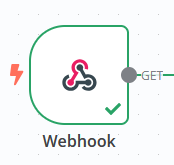
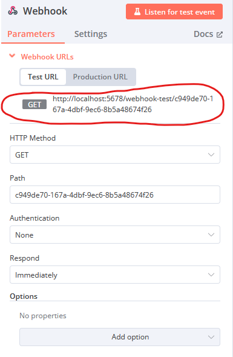

# Créer des webhooks

## Description

Ce script permet de créer automatiquement des webhooks dans un document Grist.

## Pré-requis

- N8N: récupérer l'url du webhook généréé par n8n
- Token d'accès Grist
- ID du document Grist

Pour récupérer l'url du webhook n8n, il faut, depuis la pipeline:
- Cliquer sur le node webhook

- Compléter les informations

## Script

1. Configurer les variables

Dupliquer le fichier `vars.cfg.example` et renommer le en `vars.cfg`.
Vous pouvez définir des préfix de tables sur lesquels vous ne souhaitez pas de webhooks.

2. Exécuter le script

Vous pouvez désormais exécuter le script `main.py`
